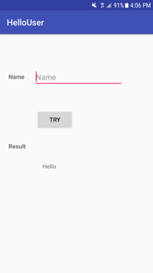
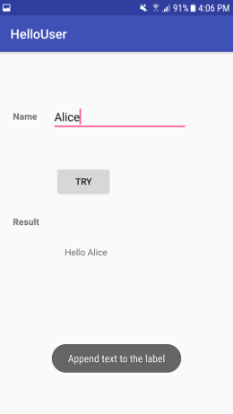

****************************
First assignment: Hello User
****************************

This is an introductory assignment to learn about mobile application programming with Android. The objective is to get familiar with basic concepts such as layouts and user interface elements (e.g., EditText and TextView). You can refer to this tutorial_ if you have not developed any Android application before.

.. _tutorial: android_getting_started

Task
====

Your task is to create an application that allows user input using an *EditText*. Such input has to be concatenated to a *TextView* once the user clicks on a button. 
 
|

|

The expected result is shown below. For instance, if the user types Alice, the output will be: *Hello Alice*.

|

|

.. ATTENTION::
   This application will be tested by using an automated unit test system. Thus, it is required to use the following id names for the UI elements:

   +------------+----------------+
   | Element    | Id name        |
   +============+================+
   | EditText   | @+id/txtInput  |
   +------------+----------------+
   | Button     | @+id/btnSubmit |
   +------------+----------------+
   | TextView   | @+id/txtResult |
   +------------+----------------+

   .. include:: note.rst
 

.. submit:: android_exercise_1 4
   :config: exercises/android_exercise_1/config.yaml
