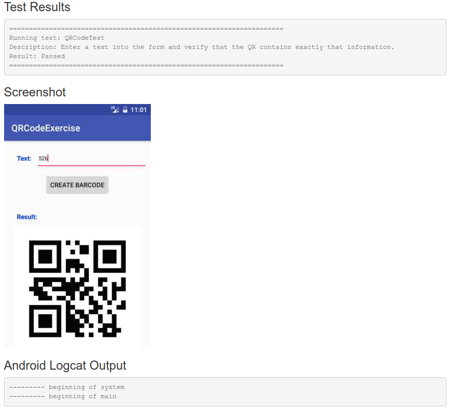

*********************************
Assignments: general instructions
*********************************

This module includes four assignments intended as an introduction to mobile application programming with Android. The concepts covered by these assignments will help you to develop the software project of the course. The assignments provide 20 out of the total points from the online exercises.

.. WARNING::

   Assignments are individual work. **Do not read or copy solutions from other students**. Remember that episodes of plagiarism and collusion are fraudulent means in studying according to the `Aalto University Code of Academic Integrity <https://into.aalto.fi/display/enregulations/Aalto+University+Code+of+Academic+Integrity+and+Handling+Violations+Thereof>`_ which may result in caution or suspension. 

The assignments consist in implementing the following applications.

* **Hello User**: prints a greeting message on the screen based on a string entered by the user into a text field (**4 points**).

* **QR Code**: generates a QR code encoding the text entered by the user into a text field (**4 points**).

* **Image List**: downloads and displays a set of images based on the URL of a JSON file provided by the user (**6 points**).

* **Image Detection**: detects faces and barcodes in a picture selected from the photo gallery (**6 points**).

Grading of the assignments is performed by an automated system. You upload your Android Application Package (i.e., **APK**) file through the *Submit* button at the bottom of the pages describing the individual assignments. The following provides some additional information on the grading system you should be aware of.

=================
Automated grading
=================

Android applications are executed through the A+ system on an emulator hosted by the Aalto IT infrastructure. Specifically, the emulator is used to run unit tests written for the `Appium <http://appium.io/>`_ automation framework. Appium allows to perform actions on the user interface of a mobile application as they were done by a user (for instance, clicking a button). *Our unit tests rely on specific ID names for the elements of your user interface, so make sure to name the elements according to the instructions specific to each assignment*.

Once the submission of your application is received, the system installs the APK on a fresh emulator image. After that, the system runs a series of unit tests to ensure that your implementation meets the specifications of the assignment. The first three assignments are evaluated as pass or fail, meaning that you receive the full amount of points if your application passes all unit tests, otherwise you receive zero points. The fourth assignment is evaluated in terms of the number of tests passed by the application, namely, you can receive part of the maximum points associated with the assignment. Each assignment has a limited number of submission attempts; we have set this value to 20 for the time being, so as to reduce the load on the grading server.

.. NOTE::

   Grading can take from 2 to 10 minutes depending on the system load. The submission page does not automatically update once grading is done, so you have to *explicitly refresh it after some time to check the result of your submission*.

.. NOTE::

   You can use the debug APK produced by Android studio (through *Build* > *Build APK*).

There are some important considerations that you should know to ensure that the unit tests run correctly on your application.

.. ATTENTION::

   Make sure to develop your application for an environment that matches the characteristics of our emulator setup:

   * Nexus S device (resolution: 480x800 hdpi);
   * API Level 25 (Android 7.1.1);
   * x86 image with Google APIs installed.

   The emulator has no access to the Internet, so you *must include all necessary libraries and code in the submitted APK*.

   Each assignment has instructions on the particular **View IDs** that should be used. It is very important to use the as our grading system relies
   on these specific IDs to produce and retrieve data from the application.

The results of the unit tests consist of feedback provided by the A+ system to help you identify issues in the execution of your application.

===============
Grader feedback
===============

After grading is completed, the system provides the following feedback on the application.

* **Test result**: indicates if your application has passed or failed the tests. The reason of a failure is also provided.

* **Screenshot**: an image capture of the emulator screen taken right before the test failed or your application crashed. The screenshot can provide insights on possible issues encountered during the execution.

* **Application log**: according to the built-in `Android Log API <https://developer.android.com/reference/android/util/Log.html>`_. The logs can help you understand the execution flow inside your application. For this purpose, you can use the functions corresponding to different levels of verbosity (e.g., *i*, *d*, *e*). *The system only shows the logs tagged with the MCC tag; messages will not appear in the feedback if you use a different tag*.

A sample submission result is the following:

