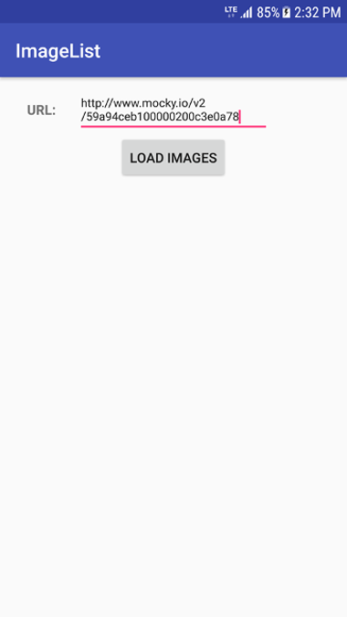
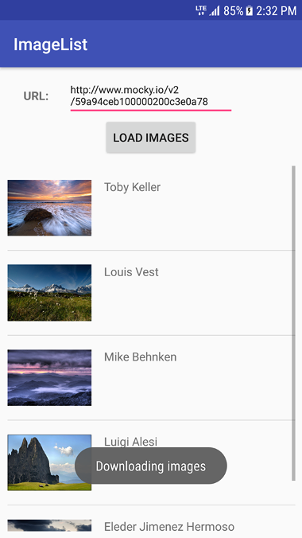

****************************
Third assignment: Image List
****************************

The objective of this assignment is to learn how to use a *ListView* to display images taken from the Internet.

Task
====

Your task is to parse a JSON file given as an input by using an *EditText*. By parsing the file, you obtain a sequence of items, each containing a link to an image and the corresponding author's name. These must be displayed in a *ListView*.

The JSON file structure is as follows.

.. code-block:: javascript

    [
        {photo:"", author:""},
        {photo:"", author:""},
        {photo:"", author:""},
        {photo:"", author:""},
        {photo:"", author:""}
    ]

Each row has the following fields:

+---------+-----------------------------------+--------+
| Field   | Description                       | Type   |
+=========+===================================+========+
| photo   | Image url                         | String |
+---------+-----------------------------------+--------+
| author  | Photographer's name.              | String |
+---------+-----------------------------------+--------+

You can use libraries such OkHttp_ for fetching the JSON file, and Picasso_ for showing the photos. You can also use any other libraries or write your own code if you prefer.

You can use following JSON file to test your application: http://www.mocky.io/v2/59a94ceb100000200c3e0a78

.. _Picasso: http://square.github.io/picasso/

.. _OkHttp: http://square.github.io/okhttp/

|

|

The expected result is shown below:

|

|

.. ATTENTION::
   This application will be tested by using an automated unit test system. Thus, it is required to use the following id names for the UI elements:

   +------------+-----------------------+
   | Element    | Id name               |
   +============+=======================+
   | EditText   | @+id/txtUrl           |
   +------------+-----------------------+
   | Button     | @+id/btnLoadImg       |
   +------------+-----------------------+

   .. include:: note.rst

.. submit:: android_exercise_3 6
   :config: exercises/android_exercise_3/config.yaml
