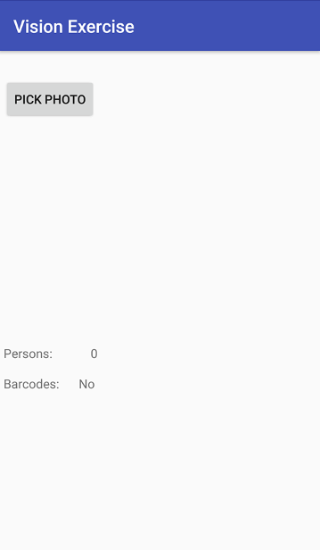
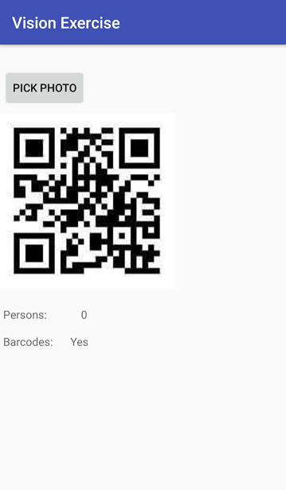
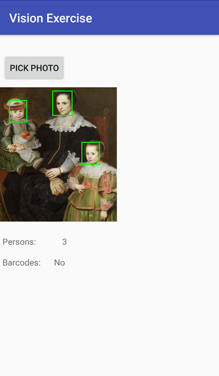

**********************************
Fourth assignment: Image Detection
**********************************

This assignment introduces you to the use of `Mobile Vision API <https://developers.google.com/vision/android/getting-started>`__ in an Android application.

.. NOTE::
	You have become familiar with layouts and control after completing the previous assignments. Thus, the objective of this assignment is to explore the Mobile Vision API for object recognition on images.

Task
====

Your task is to create an application that recognizes objects given a source picture. The user interface should include an option to select the image from the gallery of the phone by clicking a button. Once the image is selected, it should be displayed on the screen as well as the number of faces recognized and if the image contains a barcode or not. Mobile Vision API has some limitations when objects are small, but we are not interested in such cases. The test cases will be high resolution pictures with clear faces or QR codes. 

Your application should process images in a background thread to prevent blocking the User Interface thread. You should also consider proper resizing of images before displaying them, to prevent the application from running out of memory.

.. ATTENTION::
   
   Use the following Intent action and type to select a photo from the gallery. Our automated grading system relies on this to test your application with different photos.

   .. code-block:: java

      Intent intent = new Intent();
      intent.setType("image/*");
      intent.setAction(Intent.ACTION_GET_CONTENT);

|

|

The expected result is shown below:

|

+---------+---------+
| |logo1| | |logo2| |
+---------+---------+

|

.. ATTENTION::
   This application will be tested by using an automated unit test system. Thus, it is required to use the following id names for the UI elements:

   +------------+--------------------------+
   | Element    | Id name                  |
   +============+==========================+
   | Button     | @+id/btnPickPhoto        |
   +------------+--------------------------+
   | TextView   | @+id/txtNumPeople        |
   +------------+--------------------------+
   | TextView   | @+id/txtBarcode          |
   +------------+--------------------------+

   .. include:: note.rst

.. submit:: android_exercise_4 6
   :config: exercises/android_exercise_4/config.yaml

