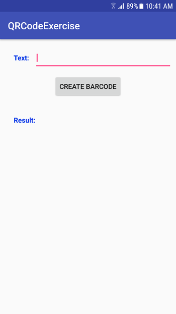
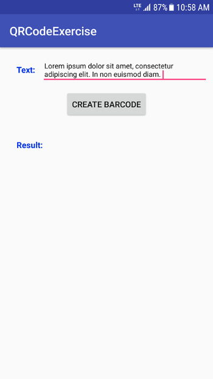
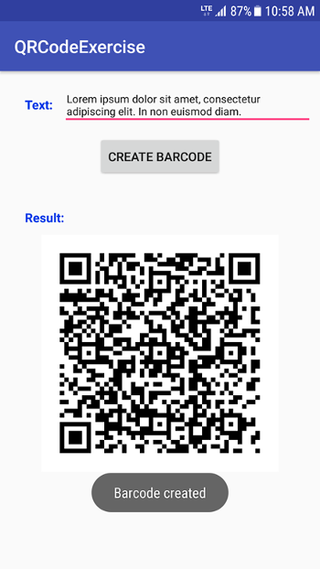

**************************
Second assignment: QR Code
**************************

The objective of this assignment is to learn how to generate barcodes with an Android application. 

Task
====

Your task is to generate QR codes based on the user input. To this end, you will use an *EditText* for the input and an *ImageView* for displaying the result, namely, the QR code that corresponds to the text. 

+---------+---------+
| |logo1| | |logo2| |
+---------+---------+

We recommend to use the ZXing library to generate the QR code. You can read more here_. 

.. _here: https://github.com/zxing/zxing

Output
======

The expected result is shown below:

|

|

.. ATTENTION::
   This application will be tested by using an automated unit test system. Thus, it is required to use the following id names for the UI elements:

   +------------+-----------------------+
   | Element    | Id name               |
   +============+=======================+
   | EditText   | @+id/txtInput         |
   +------------+-----------------------+
   | Button     | @+id/btnCreateBarcode |
   +------------+-----------------------+
   | ImageView  | @+id/imgBarcode       |
   +------------+-----------------------+

   Make sure that the QR code is visible on the screen, otherwise the unit test might fail when running your application.
	
   .. include:: note.rst

.. submit:: android_exercise_2 4
   :config: exercises/android_exercise_2/config.yaml
